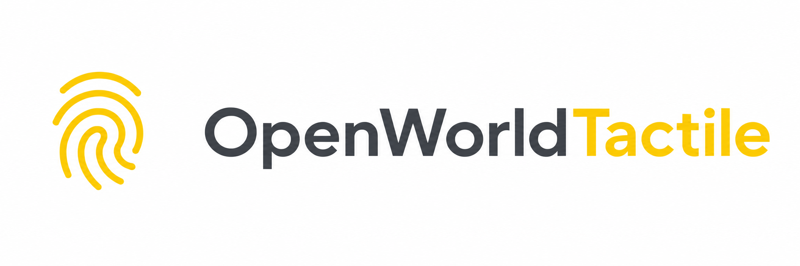
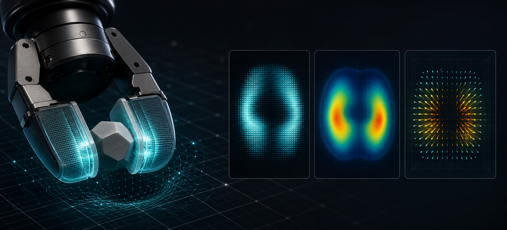
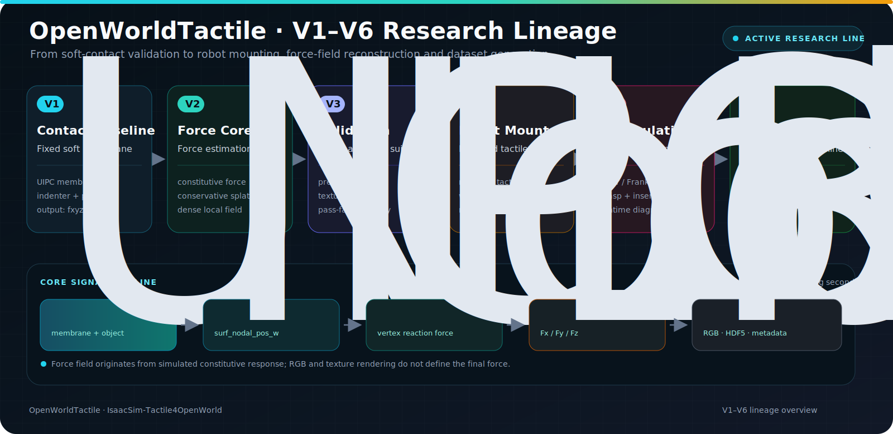

<p align="right">
  <a href="README.zh-CN.md">简体中文</a> · <strong>English</strong>
</p>

<p align="center">
  
</p>

<h1 align="center">IsaacSim-Tactile4OpenWorld</h1>

<p align="center">
  <strong>OpenWorldTactile</strong><br>
  Open-world contact, deformation, force-field, and visuotactile simulation for Isaac Sim.
</p>

<p align="center">
  A research platform for robotic contact mechanics, tactile deformation, force fields, and visuotactile sensing on Isaac Sim / Isaac Lab.
</p>

<p align="center">
  <a href="#overview">Overview</a> ·
  <a href="#quick-start">Quick Start</a> ·
  <a href="docs/OWTBENCH_VERSION_INDEX.md">Version Lineage</a> ·
  <a href="docs/ENTRYPOINT_MATRIX.md">Entrypoints</a> ·
  <a href="CITATIONS.md">Citation</a>
</p>

<p align="center">
  <a href="docs/MAINLINE_GUIDE.md"></a>
  <a href="docs/MAINLINE_GUIDE.md"></a>
  <a href="docs/MAINLINE_GUIDE.md"></a>
  <a href="docs/MAINLINE_GUIDE.md"></a>
  <a href="docs/OPEN_SOURCE_READINESS.md"></a>
  <a href="THIRD_PARTY_NOTICES.md"></a>
</p>

> [!IMPORTANT]
> OpenWorldTactile is an actively maintained research project. Passing repository-level static checks does not mean that Isaac Sim, CUDA, libuipc, external assets, or hardware-dependent workflows have been validated in every target environment. Review the [dependency and migration boundaries](docs/DEPENDENCY_GAPS.md) before running the project.

## Overview

IsaacSim-Tactile4OpenWorld is an Isaac Sim / Isaac Lab repository for robotic tactile research. Its core technical framework, **OpenWorldTactile**, brings contact simulation, compliant-membrane deformation, tactile images, three-dimensional force fields, robot assets, and an evolving experiment lineage into one research workflow.

This repository does not bundle complete Isaac Lab or Isaac Sim distributions. It extends compatible external environments with:

- tactile core modules, assets, tasks, and experiments on the Isaac Lab 2.1.1 mainline;
- libuipc/UIPC contact simulation and deformable tactile-membrane integration;
- research entry points for GelSight Mini, Taxim, FOTS, FEM, RGB, and force-field methods;
- grasping, insertion, and contact experiments for robots including AgileX Piper and Franka;
- an archived Isaac Lab 2.3.2 research line that preserves the history of the experiments.

### What “Open World” means here

In this project, open world means extending tactile experiments across robots, sensors, objects, and contact conditions. It does not claim a general-purpose world model, open-vocabulary reasoning, or zero-shot robot control in arbitrary scenes.

<p align="center">
  
</p>

<p align="center"><sub>Concept illustration of the OpenWorldTactile research pipeline — not a benchmark result.</sub></p>

## Highlights

| Research layer       | OpenWorldTactile coverage                                                           |
| -------------------- | ----------------------------------------------------------------------------------- |
| Contact physics      | UIPC/libuipc, rigid and deformable contact, compliant-membrane response             |
| Visuotactile sensing | GelSight Mini, tactile RGB, texture, and marker tracking                            |
| Force reconstruction | `Fx/Fy/Fz`, pressure, shear, projection calibration, and local force fields       |
| Robot integration    | AgileX Piper, Franka, gripper mounting, and frame transforms                        |
| Research workflows   | Grasping, lifting, insertion, rolling, contact validation, and HDF5 data collection |

## Research Lineage

OpenWorldTactileBench preserves the V1–V6.2 experiment lineage without presenting historical branches as separate architectures. V6.2 is the current default navigation point, while earlier stages remain available as validation, diagnostic, and method-evolution records.



The core signal path is:

```text
UIPC contact
  -> membrane nodal deformation
  -> constitutive reaction force
  -> tactile-local Fx / Fy / Fz field
  -> RGB, metadata, and HDF5 research outputs
```

See the [version index](docs/OWTBENCH_VERSION_INDEX.md) and [version lineage](docs/VERSION_LINEAGE.md) for the complete stage history.

## Quick Start

The mainline reference combination is Ubuntu 24.04, Python 3.10, Isaac Sim 4.5, Isaac Lab 2.1.1, and libuipc 0.9.0. This combination is a migration reference from the project documentation, not a claim that the environment was rerun during the repository refactor.

Prepare compatible Isaac Lab, Isaac Sim, CUDA, and libuipc build environments separately, then use the repository wrapper:

```bash
export ISAACLAB_PATH=/absolute/path/to/IsaacLab-2.1.1
cd active-isaaclab-2.1

./run.sh --help
./run.sh --install all
./run.sh --python experiments/tactile-bench/OpenWorldTactile_v6_2_grasp.py --help
```

Current reference entry point: [`OpenWorldTactile_v6_2_grasp.py`](active-isaaclab-2.1/experiments/tactile-bench/OpenWorldTactile_v6_2_grasp.py). It reuses force-field, data, and helper modules from the same directory and should not be treated as a standalone file.

| Start here                                     | Purpose                                                                      |
| ---------------------------------------------- | ---------------------------------------------------------------------------- |
| [Mainline guide](docs/MAINLINE_GUIDE.md)        | Environment boundaries, directory navigation, and mainline command templates |
| [Entrypoint matrix](docs/ENTRYPOINT_MATRIX.md)  | Experiments, tools, tests, and their statically identified dependencies      |
| [Version index](docs/OWTBENCH_VERSION_INDEX.md) | Stage relationships from V1 through V6.2                                     |
| [Architecture](docs/ARCHITECTURE.md)            | Core packages, assets, tasks, and UIPC integration                           |
| [Dependency gaps](docs/DEPENDENCY_GAPS.md)      | External runtime preparation and asset mappings                              |

## Version & Compatibility

The two research lines use different Isaac Lab baselines. They should not be installed into one environment and assumed to be mutually compatible.

| Route                                             | Baseline        | Role                                                   | Status                                   |
| ------------------------------------------------- | --------------- | ------------------------------------------------------ | ---------------------------------------- |
| [`active-isaaclab-2.1/`](active-isaaclab-2.1/)   | Isaac Lab 2.1.1 | Current OpenWorldTactile/UIPC mainline                 | Default development and experiment route |
| [`archive-isaaclab-2.3/`](archive-isaaclab-2.3/) | Isaac Lab 2.3.2 | Historical GelSight, RGB/force-field, and SDK research | Archive and lineage reference            |

Camera SDKs referenced by historical scripts are not distributed in the public repository. After obtaining them legally, place them under `archive-isaaclab-2.3/hardware-sdk/openworldtactile/` or set `OWT_SDK_ROOT`. See the [SDK boundary notes](archive-isaaclab-2.3/hardware-sdk/README.md).

## Repository Map

| Path                                                                    | Contents                                                                      |
| ----------------------------------------------------------------------- | ----------------------------------------------------------------------------- |
| [`active-isaaclab-2.1/packages/`](active-isaaclab-2.1/packages/)       | OpenWorldTactile core, assets, tasks, and UIPC integration                    |
| [`active-isaaclab-2.1/experiments/`](active-isaaclab-2.1/experiments/) | Tactile benchmarks, manipulation experiments, prototypes, and version lineage |
| [`archive-isaaclab-2.3/`](archive-isaaclab-2.3/)                       | Historical Isaac Lab 2.3.2 research line                                      |
| [`docs/`](docs/)                                                       | Architecture, versions, dependencies, release, and migration documentation    |
| [`tools/repository/`](tools/repository/)                               | Manifest, navigation generation, and static audit tools                       |

See the [repository architecture](docs/ARCHITECTURE.md) for detailed package and call relationships.

## Static Validation

The following checks do not install dependencies or start Isaac Sim:

```bash
py tools/repository/audit_open_source.py
py tools/repository/build_static_navigation.py
py tools/repository/finalize_layout.py
```

They inspect release files, license boundaries, common credential patterns, Python ASTs, local Markdown links, USDA references, the per-file manifest, and case-insensitive path collisions. After intentional payload changes, run:

```bash
py tools/repository/finalize_layout.py --write-manifest
```

Static validation only establishes that the repository structure and source files are parseable. It does not replace simulation, GPU, driver, numerical-correctness, or hardware validation.

## Citation, License & Contributing

Research results should cite OpenWorldTactile and the original papers for the methods actually used. See [`CITATIONS.md`](CITATIONS.md) and [`CITATION.cff`](CITATION.cff).

Original OpenWorldTactile contributions are licensed under [BSD-3-Clause](LICENSE). This is a multi-license repository: libuipc Python bindings, TetGen, GelSight-derived assets, and other upstream materials remain subject to their respective terms. Before distributing, reusing, or incorporating the project into closed-source products, review [`THIRD_PARTY_NOTICES.md`](THIRD_PARTY_NOTICES.md) and the [third-party boundaries](docs/THIRD_PARTY_BOUNDARIES.md).

Read [`CONTRIBUTING.md`](CONTRIBUTING.md) before contributing. Report security issues privately according to [`SECURITY.md`](SECURITY.md).
