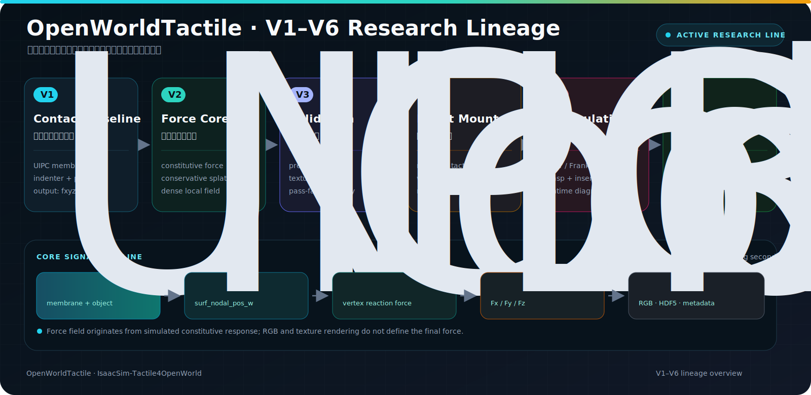

<p align="right">
  <strong>简体中文</strong> · <a href="README.md">English</a>
</p>

<p align="center">
  
</p>

<h1 align="center">IsaacSim-Tactile4OpenWorld</h1>

<p align="center">
  <strong>OpenWorldTactile</strong><br>
  Open-world contact, deformation, force-field and visuotactile simulation for Isaac Sim.
</p>

<p align="center">
  面向开放世界机器人接触、形变、力场与视触觉研究的 Isaac Sim / Isaac Lab 平台。
</p>

<p align="center">
  <a href="#overview">Overview</a> ·
  <a href="#quick-start">Quick Start</a> ·
  <a href="docs/OWTBENCH_VERSION_INDEX.md">Version Lineage</a> ·
  <a href="docs/ENTRYPOINT_MATRIX.md">Entrypoints</a> ·
  <a href="CITATIONS.md">Citation</a>
</p>

<p align="center">
  <a href="docs/MAINLINE_GUIDE.md"></a>
  <a href="docs/MAINLINE_GUIDE.md"></a>
  <a href="docs/MAINLINE_GUIDE.md"></a>
  <a href="docs/MAINLINE_GUIDE.md"></a>
  <a href="docs/OPEN_SOURCE_READINESS.md"></a>
  <a href="THIRD_PARTY_NOTICES.md"></a>
</p>

> [!IMPORTANT]
> OpenWorldTactile 是持续维护的研究项目。仓库级静态检查通过，不代表 Isaac Sim、CUDA、libuipc、外部资产或硬件相关流程已在任意目标环境完成运行验证。运行前请阅读[依赖与迁移边界](docs/DEPENDENCY_GAPS.md)。

## Overview

IsaacSim-Tactile4OpenWorld 是一个面向机器人触觉研究的 Isaac Sim / Isaac Lab 仓库。仓库内的核心技术框架 **OpenWorldTactile** 将接触仿真、柔性膜形变、触觉图像、三维力场、机器人资产和实验谱系统一在同一研究工作流中。

它不是 Isaac Lab 或 Isaac Sim 的完整发行版，而是在外部兼容环境之上提供：

- Isaac Lab 2.1.1 主线下的触觉核心、资产、任务和实验；
- libuipc/UIPC 接触仿真与可形变触觉膜集成；
- GelSight Mini、Taxim、FOTS、FEM、RGB 与力场相关研究入口；
- AgileX Piper、Franka 等机器人上的抓取、插孔和接触实验；
- Isaac Lab 2.3.2 历史研究路线，用于追踪实验演进。

### What “Open World” means here

本项目中的开放世界指跨机器人、跨传感器、跨物体和跨接触条件扩展触觉实验的能力。它不表示项目已经实现通用世界模型、开放词汇推理或任意场景下的零样本机器人控制。

<p align="center">
  
</p>

<p align="center"><sub>OpenWorldTactile 研究流程概念图，并非基准测试结果。</sub></p>

## Highlights

| Research layer | OpenWorldTactile coverage |
|---|---|
| Contact physics | UIPC/libuipc、刚体与可形变接触、柔性膜响应 |
| Visuotactile sensing | GelSight Mini、触觉 RGB、纹理与标记点跟踪 |
| Force reconstruction | `Fx/Fy/Fz`、压力、剪切、投影标定与局部力场 |
| Robot integration | AgileX Piper、Franka、夹爪挂载与坐标系转换 |
| Research workflows | 抓取、抬升、插孔、滚动、接触验证与 HDF5 数据采集 |

## Research Lineage

OpenWorldTactileBench 保留 V1–V6.2 的实验演进，但不会将历史分支包装成互不相关的新架构。当前默认导航是 V6.2，早期阶段继续作为验证、诊断和方法演进记录存在。



核心信号路径是：

```text
UIPC contact
  -> membrane nodal deformation
  -> constitutive reaction force
  -> tactile-local Fx / Fy / Fz field
  -> RGB, metadata and HDF5 research outputs
```

完整阶段说明见[版本索引](docs/OWTBENCH_VERSION_INDEX.md)和[版本谱系](docs/VERSION_LINEAGE.md)。

## Quick Start

主线参考组合为 Ubuntu 24.04、Python 3.10、Isaac Sim 4.5、Isaac Lab 2.1.1 与 libuipc 0.9.0。该组合来自项目现有说明，是迁移参考而不是本轮重新运行验证的结论。

先独立准备兼容的 Isaac Lab、Isaac Sim、CUDA 和 libuipc 构建环境，然后使用仓库包装入口：

```bash
export ISAACLAB_PATH=/absolute/path/to/IsaacLab-2.1.1
cd active-isaaclab-2.1

./run.sh --help
./run.sh --install all
./run.sh --python experiments/tactile-bench/OpenWorldTactile_v6_2_grasp.py --help
```

当前参考入口：[`OpenWorldTactile_v6_2_grasp.py`](active-isaaclab-2.1/experiments/tactile-bench/OpenWorldTactile_v6_2_grasp.py)。该脚本会复用同目录的力场、数据和辅助模块，不能只复制单个文件作为独立程序。

| Start here | Purpose |
|---|---|
| [Mainline guide](docs/MAINLINE_GUIDE.md) | 环境边界、目录导航和主线运行模板 |
| [Entrypoint matrix](docs/ENTRYPOINT_MATRIX.md) | 查找实验、工具、测试及其静态依赖 |
| [Version index](docs/OWTBENCH_VERSION_INDEX.md) | 理解 V1–V6.2 的阶段关系 |
| [Architecture](docs/ARCHITECTURE.md) | 理解核心包、资产、任务和 UIPC 集成 |
| [Dependency gaps](docs/DEPENDENCY_GAPS.md) | 准备外部运行环境和资产映射 |

## Version & Compatibility

两条研究路线使用不同 Isaac Lab 基线，不应安装到同一个环境后假定相互兼容。

| Route | Baseline | Role | Status |
|---|---|---|---|
| [`active-isaaclab-2.1/`](active-isaaclab-2.1/) | Isaac Lab 2.1.1 | 当前 OpenWorldTactile/UIPC 主线 | 默认开发与实验路线 |
| [`archive-isaaclab-2.3/`](archive-isaaclab-2.3/) | Isaac Lab 2.3.2 | GelSight、RGB/力场和 SDK 历史研究 | 归档与演进参考 |

历史脚本依赖的相机 SDK 不随公开仓库分发。合法取得后可放入 `archive-isaaclab-2.3/hardware-sdk/openworldtactile/`，或通过 `OWT_SDK_ROOT` 指定；详见 [SDK 边界说明](archive-isaaclab-2.3/hardware-sdk/README.md)。

## Repository Map

| Path | Contents |
|---|---|
| [`active-isaaclab-2.1/packages/`](active-isaaclab-2.1/packages/) | OpenWorldTactile 核心、资产、任务和 UIPC 集成 |
| [`active-isaaclab-2.1/experiments/`](active-isaaclab-2.1/experiments/) | 触觉基准、操作实验、原型与版本演进 |
| [`archive-isaaclab-2.3/`](archive-isaaclab-2.3/) | Isaac Lab 2.3.2 历史研究路线 |
| [`docs/`](docs/) | 架构、版本、依赖、发布与迁移文档 |
| [`tools/repository/`](tools/repository/) | 清单、导航生成器和静态审计工具 |

更细的包和调用关系见[仓库架构](docs/ARCHITECTURE.md)。

## Static Validation

以下检查不安装依赖，也不启动 Isaac Sim：

```bash
py tools/repository/audit_open_source.py
py tools/repository/build_static_navigation.py
py tools/repository/finalize_layout.py
```

它们检查发布文件、许可证边界、常见凭据形态、Python AST、Markdown 本地链接、USDA 引用、逐文件清单和大小写路径冲突。载荷有意变化后，使用：

```bash
py tools/repository/finalize_layout.py --write-manifest
```

静态检查只能证明仓库结构与源码可解析，不能替代仿真、GPU、驱动、数值正确性或硬件验证。

## Citation, License & Contributing

研究成果请同时引用 OpenWorldTactile 及实际使用方法的原始论文，见 [`CITATIONS.md`](CITATIONS.md) 和 [`CITATION.cff`](CITATION.cff)。

原创 OpenWorldTactile 贡献采用 [BSD-3-Clause](LICENSE)。本仓库是多许可证集合；libuipc Python 绑定、TetGen、GelSight 衍生资产及其他上游材料适用各自条款。分发、复用或用于闭源产品前，请阅读 [`THIRD_PARTY_NOTICES.md`](THIRD_PARTY_NOTICES.md) 和[第三方边界](docs/THIRD_PARTY_BOUNDARIES.md)。

贡献前请阅读 [`CONTRIBUTING.md`](CONTRIBUTING.md)；安全问题按 [`SECURITY.md`](SECURITY.md) 私下报告。
