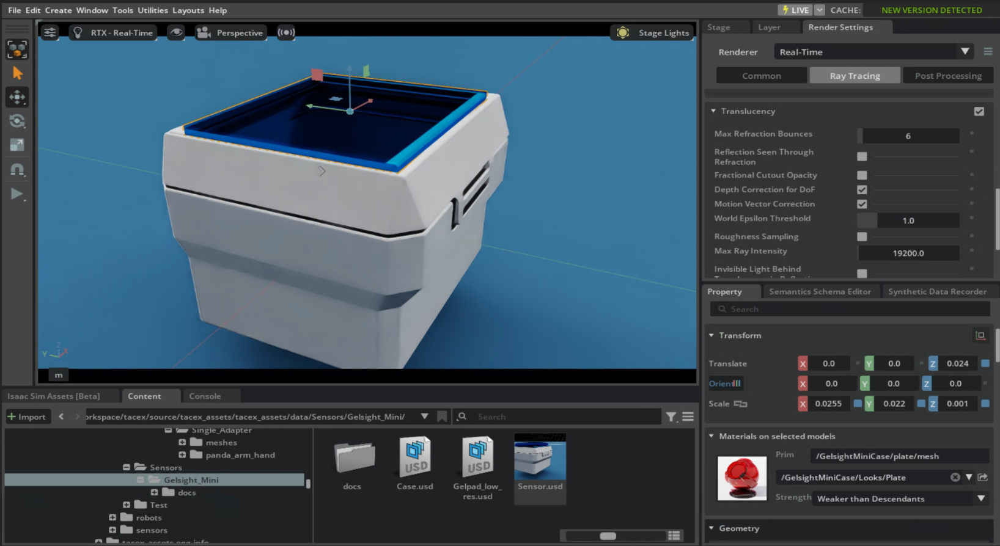

# GelSight Mini Sensor
- Source of the sensor model (gelpad and case): https://github.com/gelsightinc/gsrobotics (last accessed 15.02.2025).
- Datasheet: https://www.gelsight.com/wp-content/uploads/productsheet/Mini/GelSight_Datasheet_GSMini.pdf (last accessed 15.02.2025)

## License and attribution

The upstream `gelsightinc/gsrobotics` repository distributes its code and CAD models under GPL-3.0. The sensor model, converted USD forms, textures, and calibration material in this `GelSight_Mini` distribution are therefore provided conservatively under GPL-3.0-only; retain the adjacent `LICENSE` and the repository-level `THIRD_PARTY_NOTICES.md` when redistributing them.

The Taxim-format calibration data and rendering workflow also require citation of Zilin Si and Wenzhen Yuan, “Taxim: An Example-Based Simulation Model for GelSight Tactile Sensors,” DOI: https://doi.org/10.1109/LRA.2022.3142412. Citation is separate from the software license.

<todo insert img from model and real sensor>

## Overview
The GelSight Mini is a high resolution Tactile Sensor.
<todo Description about GelSight Mini>

## Model Description
We separated sensor case and gelpad to specify different physics properties for the sensor.
For example
- soft vs. rigid gelpad (PhysX)
- soft body gelpad with custom physics (e.g., IPC)
- different friction values for gelpad vs. case

Additionally we added a translucent plate between gelpad and sensor case.
This plate is used to attach the gelpad to the sensor case (in PhysX based simulation).
The translucency is important for camera based simulation approaches.
Without it, the camera would render images of the plate and not of the indenter.
Alternatively, you can turn the meshes that get in the way of the camera invisible.
If the `Translucency` is not activated in the Render Settings then the objects are simply invisible.

> For whatever reason transluent objects are just "shine through" everything else, i.e. they are always visible.

Like the real sensor, our model contains a camera at the center of the case.
The camera can be used for tactile simulation approaches that use height maps of the indentation (e.g. Taxim, FOTS).
<todo add camera properties description>

Dimensions (length x width x height):
- case 32mm x 28mm x 24mm
- gelpad 25.25mm x 20.75mm x 4mm

<todo Insert sketch of gelsight mini model>
